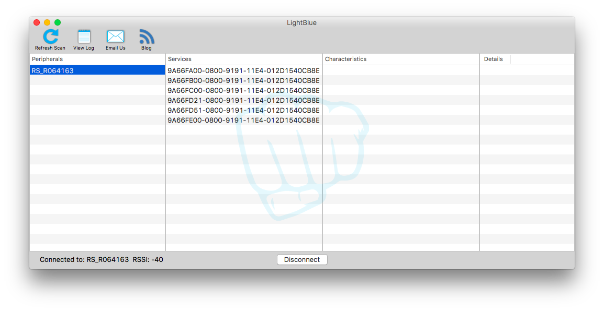

# Using Golang

Here are some projects that use golang for drones:

* https://github.com/hybridgroup/gobot
* http://gort.io/


To try it, install [gobot](https://github.com/hybridgroup/gobot) and create the test program found in the gobot README for the [minidrone API package](https://github.com/hybridgroup/gobot/tree/master/platforms/parrot/minidrone).  Remember that it must be on your `GOPATH`.  

```
package main

import (
	"fmt"
	"os"
	"time"

	"gobot.io/x/gobot"
	"gobot.io/x/gobot/platforms/ble"
	"gobot.io/x/gobot/platforms/parrot/minidrone"
)

func main() {
	bleAdaptor := ble.NewClientAdaptor(os.Args[1])
	drone := minidrone.NewDriver(bleAdaptor)

	work := func() {
		drone.On(minidrone.Battery, func(data interface{}) {
			fmt.Printf("battery: %d\n", data)
		})

		drone.On(minidrone.FlightStatus, func(data interface{}) {
			fmt.Printf("flight status: %d\n", data)
		})

		drone.On(minidrone.Takeoff, func(data interface{}) {
			fmt.Println("taking off...")
		})

		drone.On(minidrone.Hovering, func(data interface{}) {
			fmt.Println("hovering!")
			gobot.After(5*time.Second, func() {
				drone.Land()
			})
		})

		drone.On(minidrone.Landing, func(data interface{}) {
			fmt.Println("landing...")
		})

		drone.On(minidrone.Landed, func(data interface{}) {
			fmt.Println("landed.")
		})

		time.Sleep(1000 * time.Millisecond)
		drone.TakeOff()
	}

	robot := gobot.NewRobot("minidrone",
		[]gobot.Connection{bleAdaptor},
		[]gobot.Device{drone},
		work,
	)

	robot.Start()
}
```

Before trying anything, make sure you're connected to the drone using [LightBlue](https://itunes.apple.com/gb/app/lightblue/id639944780?mt=12) :



Once you are, do:

```
$ gort scan ble
Scanning for 5s...
[e2d76ade207d4a9a95cfb51c240baee7] C -48: Name: RS_R072470, MD: 4300CF1900090100
[e2d76ade207d4a9a95cfb51c240baee7] C -48: Name: RS_R072470
```

Then you can run the program; note that [you need to turn off the cgo check](https://github.com/hybridgroup/gobot/issues/298):  

```
GODEBUG=cgocheck=0 go run main.go RS_R072470
```

The drone should hover for 5 seconds and then land.
