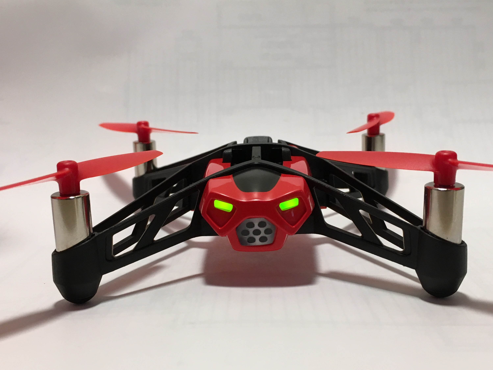

# Learn to Program with Drones

The use the Jupyter Notebook and the javascript kernel to create sets of programming excercises that illustrate programming concepts:

* variables
* functions
* loops

Then do exercises that are basically like the logo turtle, but in 3D and with a drone.

* Capstone exercise: Kids synchronized drone show
