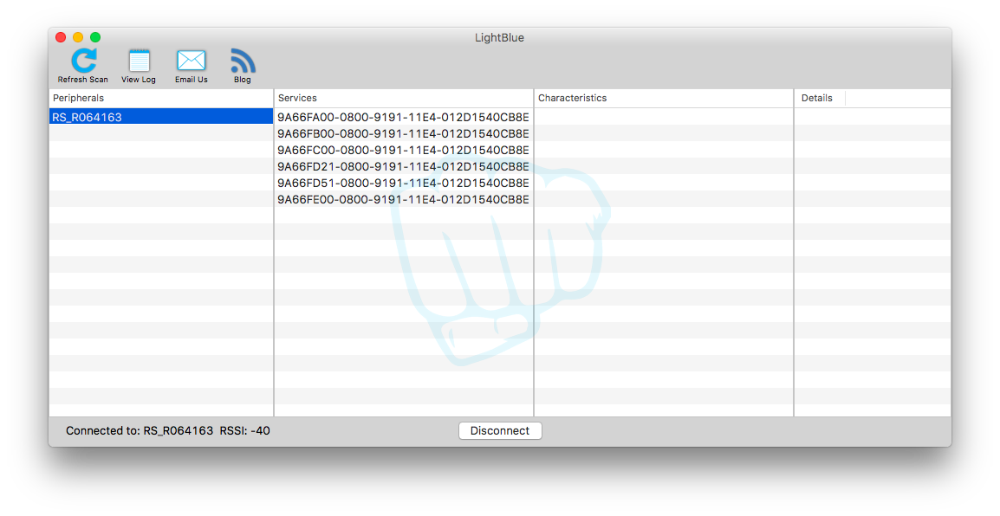

Learn to Program with Drones

Get a Parrot MiniDrone Rolling Spider drone:

https://www.amazon.com/gp/product/B00KZM53ZK/ref=oh_aui_detailpage_o00_s00?ie=UTF8&psc=1

Connect to it over bluetooth:

http://www.mathworks.com/help/supportpkg/parrot/ug/connect-parrot-minidrone-using-bluetooth-on-mac.html

https://www.macobserver.com/tmo/article/os-x-bluetooth-menu-reset-devices
* shift+option and clicking the bluetooth icon will give you a debug menu

https://community.parrot.com/t5/Rolling-Spider-Knowledge-Base/Software-Update-Process/ta-p/122999

http://emmanuelgranatello.blogspot.it/2016/04/hack-drone-notes.html

# Turning on the drone

If the drone's front is facing you, look over the top.  There is a tiny red tab that you must press in to turn it on or off.  I found to worked best if I used the nail of my index finger perpendicular to the tab.  Both eyes will turn green when the drone is booted and ready to connect.

# Getting a bluetooth connection

You have to be able to connect to Bluetooth Low energy, but OSX Sierra doesn't show BLE devices.  Per [how-to-connect-from-drone-to-pc-by-bluetooth](http://forum.developer.parrot.com/t/how-to-connect-from-drone-to-pc-by-bluetooth/5137/5), you can download the free [LightBlue](https://itunes.apple.com/gb/app/lightblue/id639944780?mt=12) app, which will let you be able to see and connect to your drone.

Once it starts, you should see the drone appear in the list of Periphrials (it will end with start with the prefix `RS_`):

Once you've selected the devices, hold down the shift+option and click the bluetooth icon in the menu bar.  This will show you the [debug menu for bluetooth]( https://www.macobserver.com/tmo/article/os-x-bluetooth-menu-reset-devices
) and provide some additional information you'll need later.

Connect to it with JavaScript:

* https://github.com/voodootikigod/node-rolling-spider

The use the Jupyter Notebook and the javascript kernel to create sets of programming excercises that illustrate programming concepts:

* variables
* functions
* loops

Then do excrcises that are basically like the logo turtle, but in 3D and with a drone.

* Capstone exercise: Kids synchronized drone show
